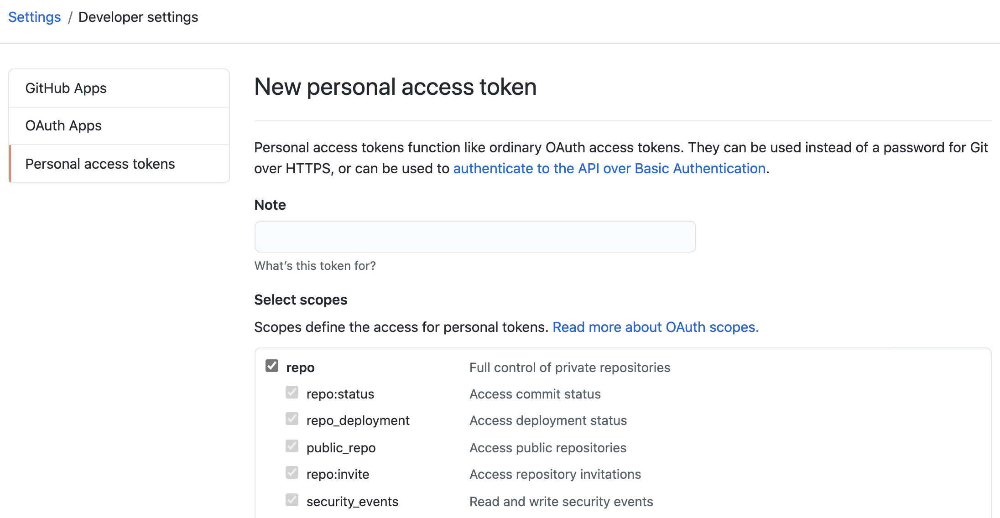

```{r, include = FALSE}
knitr::opts_chunk$set(
  fig.path = "man/figures/"
)
```

## Install and run

### 1. Site information
Before going into any coding, please confirm your site parameters on [this google sheet](https://docs.google.com/spreadsheets/d/1epcYNd_0jCUMktOHf8mz5v651zy1JALD6PgzobrGWDY/edit?usp=sharing).
If anything is incorrect or if your site is not there, please notify @trang1618 via Slack to make correction.

_Note_: `icd_version = 9` when the site's ICD codes are primarily of version 9, and `include_race = FALSE` when site does not have race information.

### 2. Dockering in

Now that you have verified your site specifics, on the command line, open the Docker container, replacing `your_path_here` with the path to the directory containing folder `Input` (where your site-specific datasets are stored):

```{bash eval=FALSE}
docker run \
  --name 4ce \
  --volume your_path_here:/4ceData \
  --rm -it \
  dbmi/4ce-analysis:version-2.0.0 R
```

### 3. While in terminal R

The above lines should open up the interactive R environment on your terminal.
Now, while in R, install the development version of **Phase2.1NeuroRPackage** from GitHub with remotes and run:

```{r, eval=FALSE}
remotes::install_github('covidclinical/Phase2.1NeuroRPackage',
                        subdir = 'FourCePhase2.1Neuro',
                        upgrade = FALSE)

library(Phase2.1NeuroRPackage)
runAnalysis()
```

### 4. Submit

Finally, please submit the results to [Phase2.1NeuroRSummariesPublic](https://github.com/covidclinical/Phase2.1NeuroRSummariesPublic):

- Share with @trang your GitHub handle via direct message or the #neuro Slack channel so you can be added as contributor to the repository.
- Note that you would need to use a token to access **private** repos, see [here](https://docs.github.com/en/github/authenticating-to-github/creating-a-personal-access-token).
Briefly, to generate a new token, go to your GitHub settings -> Developer settings -> Personal access tokens -> Generate.


Finally, run:

```{r, eval=FALSE}
submitAnalysis()
```

#### Alternatively

If everything runs smoothly, your results would also be saved under `your_path_here` (where you specified the `Input` folder earlier).
For example, for me, it's `/data2/home/ttle/4ce/UPENN_results.rda`.
If somehow `submitAnalysis()` didn't allow you to upload the results to [Phase2.1NeuroRSummariesPublic](https://github.com/covidclinical/Phase2.1NeuroRSummariesPublic), 
you can share the results file with us (@meghutch and @trang) via the #neuro Slack channel.

## Other notes

As reference, site obfuscation parameters (`mask_thres` and `blur_abs`) are [here](https://docs.google.com/spreadsheets/d/1Xl9juDBXt86P3xQtsoTaBl2zPl1BIiAG9DI3Rotyqp8/edit#gid=212461777).

To get back to the command line at any point, type `quit()` in the R environment.
Note that this will exit the container, and you would have to open another one and reinstall the package if you want to rerun.

If you run into any problem adapting this code to your data, let us know via Slack or [submit an issue](https://github.com/covidclinical/Phase2.1NeuroRPackage/issues/new).

Thank you very much for your contribution!
